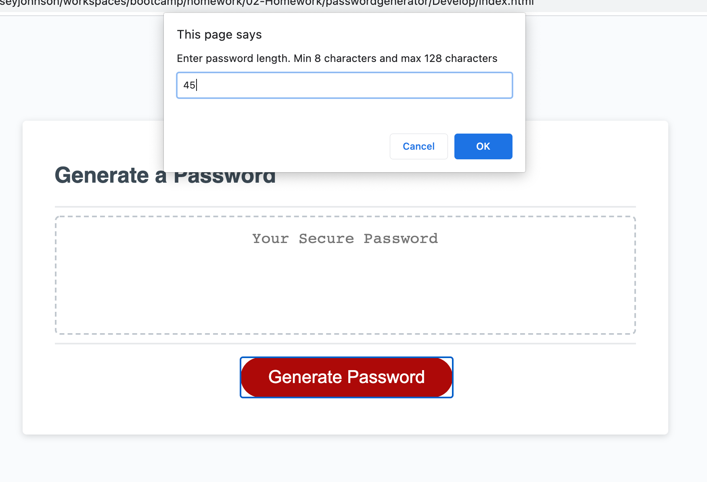
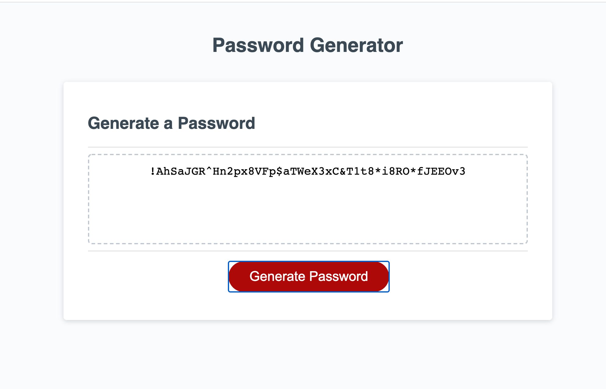

# **passwordgenerator**

[Link to Website] (https://johnsoncm.github.io/passwordgenerator/)

****
****
****

The supplied JavaScript codebase was edited to develop a useable password generator - allowing users to create strong passwords to ensure greater security.

When the user clicks the "Generate Password" button, they are presented with a series of prompts to determine:
- the length of the password (between 8 and 128 characters)
- whether they would like uppercase, lowercase, numbers and special characters in their password

Upon completing prompts a password is populated in the box on the page.

The page does not produce any errors in the console when using the inspector in Chrome DevTools.
